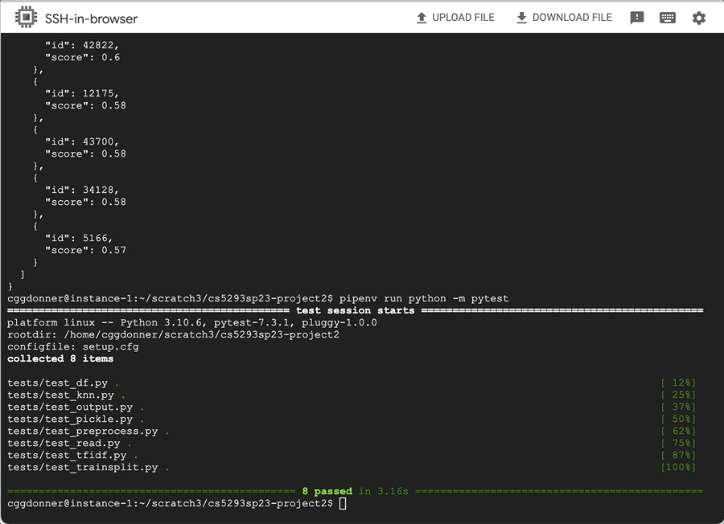

# cs5293sp23-project2
## Authored by Catherine Donner (cggdonner)
Repo used for Text Analytics Project 2 workspace

## Project Description
This project is designed to train the provided food data in the yummly.json dataset to predict a cuisine given the user's command line arguments. 
Using the model it trains the data on, the interface then finds the N-closest cuisines (as args.N in the command line) and returns the IDs of those cuisines, as well as the simlarity scores of those cuisines to the input ingredients, to the user.
The provided dataset for the project, yummly.json, contains the cuisines to predict (with their respective IDs) as well as the ingredients associated with each cuisine. 
The output of the program lists the cuisine with highest similarity score given the input ingredients, and then the n-closest cuisine IDs with their respective similarity scores (given args.N).
I used the Scikit-Learn TfidfVectorizer for vectorizing the data while preprocessing and the Scikit-Learn K-Nearest Neighbors model for training the data.

## How to Install
You can install my Project 2 using the command: git clone https://github.com/cggdonner/cs5293sp23-project2.git.

You will have to sign into the repository with your credentials as a collaborator. 
After cloning the GitHub repository into your terminal, you can access it using the command cd cs5293sp23-project2/. 
To view all files and directories in the terminal, use the command tree .

## How to Run
In the terminal, you use the following command to run project2.py in the pip environment:

pipenv run python project2.py --N 5 --ingredient paprika --ingredient "romaine lettuce" --ingredient "feta cheese crumbles"

Note that this is a sample command; the argument following the --ingredient flag can be any ingredient that you wish to input and --ingredient can also be input as many times as you wish into the terminal. 
The flag --N represents the number of n-closest cuisines that you want the program to return.

To run test files in the terminal, use the command:

pipenv run python -m pytest

## Methods in project2.py
read_json() - This takes in the parameter filename and returns json.load(f) where f is the opened filename. This method reads in the yummly.json dataset and returns the read-in dataset. 
In main(), the filename is the 'yummly.json' dataset.

convert_to_df() - This takes in the parameter json and returns a Pandas dataframe, df.
This method converts the json dataset into a Pandas dataframe. 
In main(), the json file is the read-in yummly.json dataset.

preprocess_dataset() - This takes in the parameter df and returns ingredients. 
This method adds all ingredients from the 'ingredients' column of the yummly dataframe to a list object called ingredients and returns that list.
In main(), the df taken as input is the training set X_train.

preprocess_input() - This takes in the parameters all_ingredients and ingredients. 
This method takes the result of preprocess_dataset(), all_ingredients, and appends all of the input ingredients together; it returns input_ingredients. 
In main(), the parameter ingredients is args.ingredient.

train_split_data() - This takes in the parameter X and returns X_train and X_test. 
This splits the dataframe df into a training set of 80% size and a testing set of 20% size.

vectorize_data() - This takes in the paramter X and returns tfidf, the TfidfVectorizer that is initialized in the method, and X_vec, the vectorized training set. 
This method uses Tf-Idf vectorization to preprocess all_ingredients (in main()) and prepare it for modelling.

train_knn() - This method takes in the parameters X_vec, Y, and num_neighbors.
This method initializes the KNeighborsClassifier and fits the model using X_vec and Y, and returns the model variable knn.
In main(), these are X_vec, X_train['cuisine'], and args.N, as the KNN model uses the vectorized ingredients and the cuisines in the data to predict the cuisines.
For args.N, it tells the KNN model how many nearest neighbors to prepare to return in predict_cuisines().

predict_cuisines() - This takes in the parameters knn, X_vec, input_vec, n_closest_cuisines, and dataset, and returns output. 
This method first computes the predicted cuisine and the highest score using the predict() and predict_proba() functions in the KNeighborsClassifier package. 
Then the scores of the n-closest cuisines are calculated using cosine similarities between input_vec and X_vec, and these are sorted in descending order.
The output is created in JSON format listing the top cuisine, the prediction score of that cusine, and the n-closest cuisines (IDs and scores) appended to the 'closest' list.
In main(), n_closest_cuisines is replaced with args.N.

main() - The main function takes args (args.N and args.ingredient) and calls all previous functions, printing the output as the final result.
The train_knn() and vectorize_data() methods are called in an if-conditional using the pickle package if the knn and tfidf models have not already been saved (to prevent a different output by the program every time it is run). 

## Tests
For testing project2.py, I created these tests:

test_read() - I called the function read_json to import the data into the program and included the assertion that the length of the dataset was at least 1. If it was at least 1, then it means that the yummly dataset was imported sucessfully.

test_df() - I called read_json() and convert_to_df() and made an assertion to make sure that the shape of the dataframe was of certain dimensions.

test_preprocess() - I called all functions leading up to and including preprocess_dataset() and preprocess_input(). 
I set a sample input ingredient list that I used in the rest of my test functions instead of the args.ingredient inputs. 
I then asserted the lengths of all_ingredients, input_ingredients, and all_ingredients-1 (the last in brackets, this was the input ingredients concatenated together in a string).

test_split() - I called all functions leading up to train_split_data() and asserted that the sizes of the training and testing data sets were 80% and 20% respectfully. 
This also included the pytest.approx method to accommodate for rounding that could affect the passing of this test.

test_tfidf() - I called all functions leading up to vectorize_data() and asserted that the shape of the vectorized training data was the same as the length of the non-vectorized training data.

test_knn() - I called all functions leading up to train_knn() and asserted the number of neighbors (knn.n_neighbors), and that the model had attributes 'predict' and 'predict_proba', which would mean that the KNN model could then make predictions over the data.

test_pickle() - I called all functions leading up to train_knn() except since the pickle package was implemented in main(), I tested to make sure that the if-conditional containing the pickle methods worked. 
This test included assertions to make sure that the TfidfVectorizer model was not None and that the KNN model was not None (if passed, that meant that these models had already been saved).

test_output() - I called all functions leading up to predict_cuisines(). 
Not including indentation, I included an assertion to make sure that the output from the program matched the output that would be expected given the input sample ingredients (because of including the pickle package, the output was exactly the same every time the program was run).

## Bugs and Assumptions
When putting the --ingredient flags into the terminal, single-word ingredients can be accepted without requiring double quotes, however multiple-word ingredients will require double quotes.
If you remove the tfidf.pkl and/or the knn.pkl files from the Project 2 directory, the tests test_output() and test_knn() will not pass because you are resetting the models and some of the values to assert will be different than the previous models.
Therefore, the tests only pass if you do not interefere with the storage of the pickled models.
I originally had used CountVectorizer and K-Means models for vectorization and modelling, however due to the poor performance of this modelling approach I was advised by the professor and TA to use TfIdfVectorizer and KNN models instead, which explains me changing my modelling approach.
An assumption for grading: this project was given a 2-day extension to be due later than the original due date of April 25th, and this was granted by the TA.

